# EzyMarket - Kiến Trúc Hệ Thống (System Architecture)

## 1. Tổng Quan Kiến Trúc Hệ Thống (System Architecture Overview)

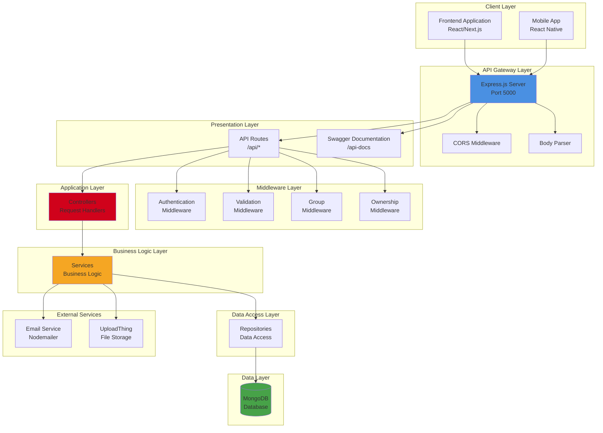

## 2. Kiến Trúc Phân Lớp Chi Tiết (Layered Architecture Detail)

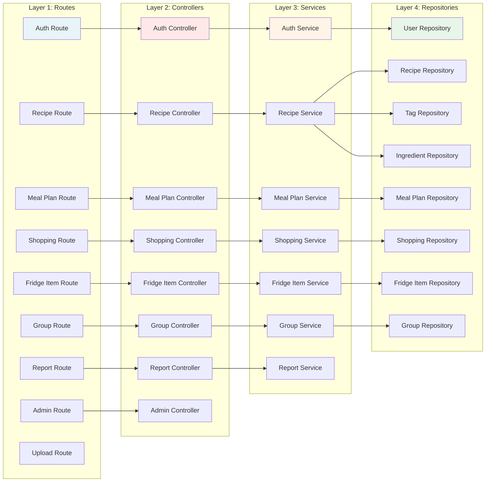

## 3. Luồng Xử Lý Request (Request Flow Diagram)

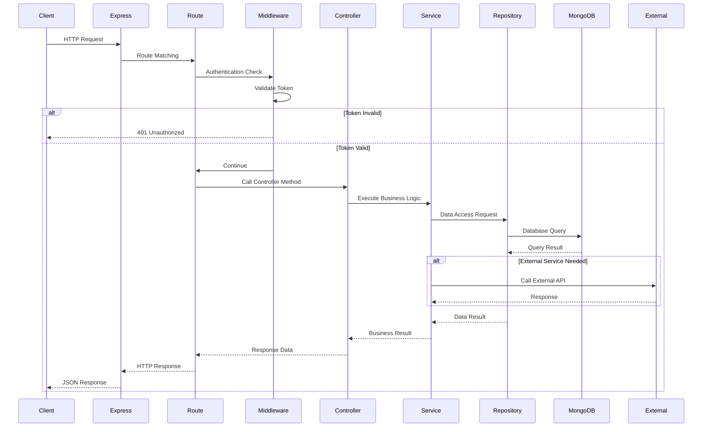

## 4. Cấu Trúc Module và Phụ Thuộc (Module Dependencies)

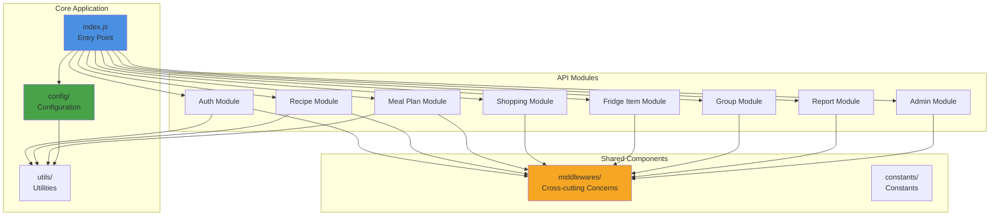

## 5. Kiến Trúc Bảo Mật (Security Architecture)

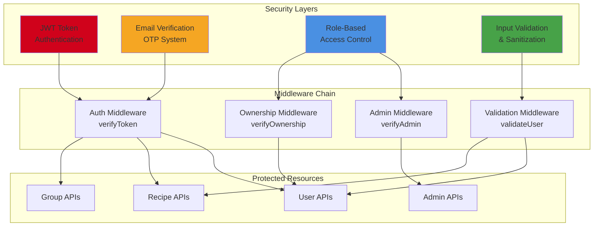

## 6. Kiến Trúc Dữ Liệu (Data Architecture)

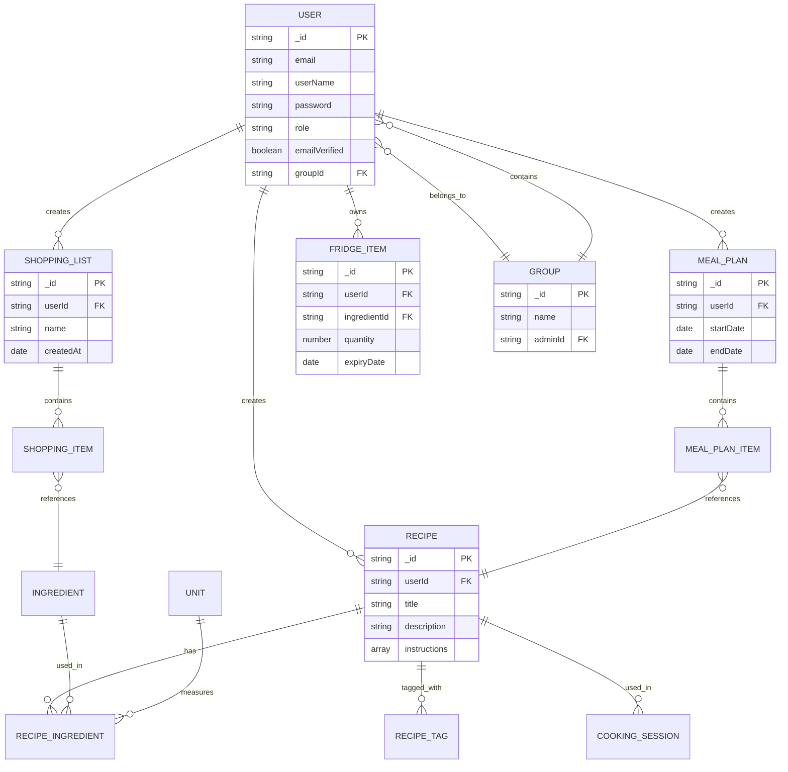

## 7. Luồng Xác Thực và Phân Quyền (Authentication & Authorization Flow)

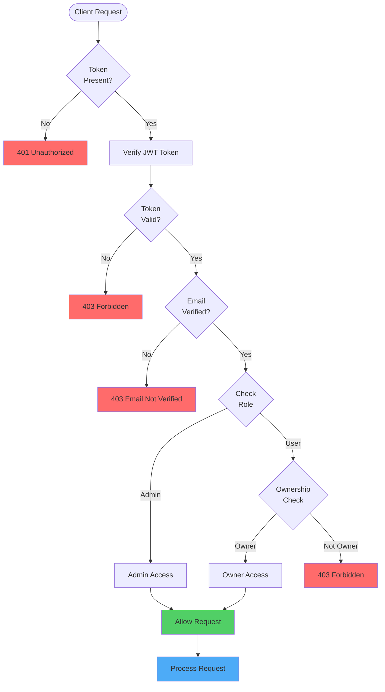

## 8. Kiến Trúc Tích Hợp Dịch Vụ Bên Ngoài (External Services Integration)

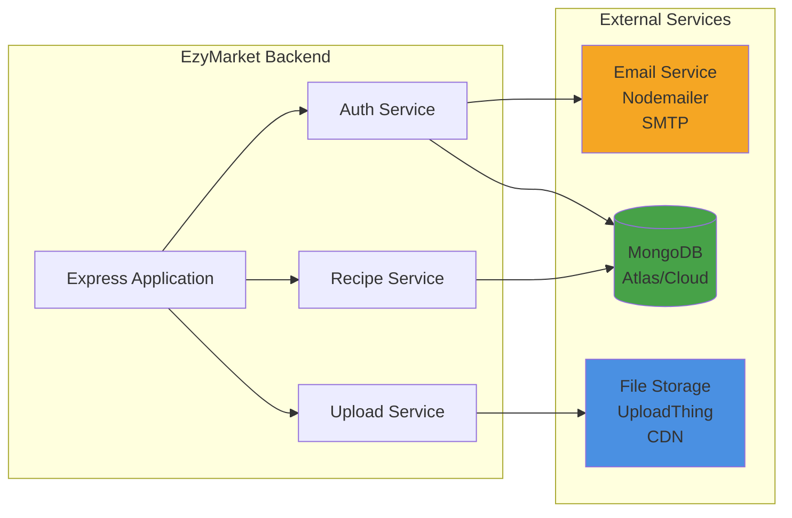

## 9. Kiến Trúc API Endpoints (API Endpoints Architecture)

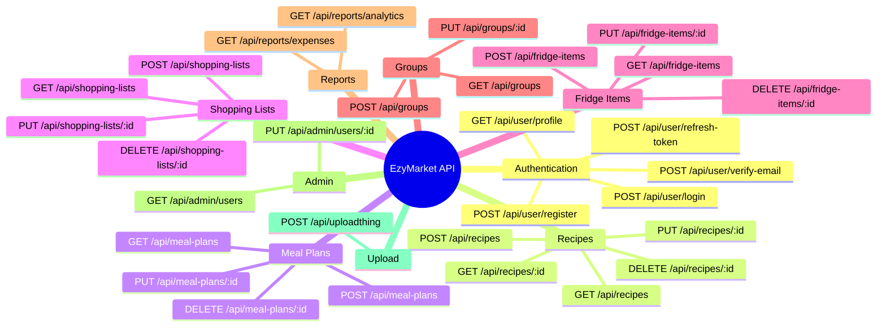

## 10. Kiến Trúc Deployment (Deployment Architecture)

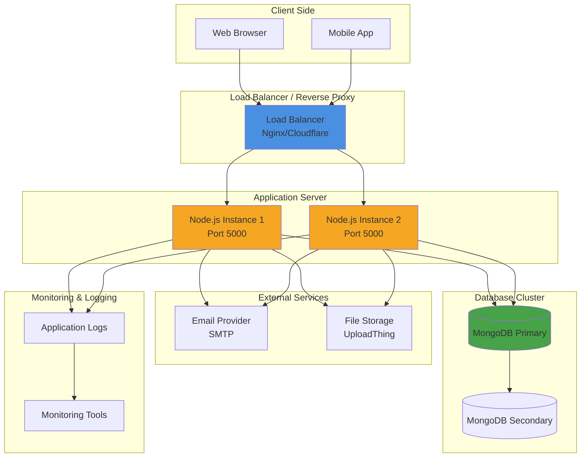

---

## Hướng Dẫn Sử Dụng

Các sơ đồ Mermaid trên có thể được sử dụng trong:

1. **Tài liệu báo cáo**: Copy mã Mermaid vào file Markdown hoặc tài liệu hỗ trợ Mermaid
2. **GitHub/GitLab**: Tự động render Mermaid trong README.md hoặc documentation
3. **Notion/Confluence**: Hỗ trợ Mermaid diagrams
4. **Mermaid Live Editor**: https://mermaid.live để preview và export

### Các Sơ Đồ Chính:

- **Sơ đồ 1**: Tổng quan kiến trúc hệ thống - cho cái nhìn tổng thể
- **Sơ đồ 2**: Kiến trúc phân lớp - chi tiết các module
- **Sơ đồ 3**: Luồng xử lý request - sequence diagram
- **Sơ đồ 4**: Cấu trúc module - dependencies
- **Sơ đồ 5**: Kiến trúc bảo mật - security layers
- **Sơ đồ 6**: Kiến trúc dữ liệu - ER diagram
- **Sơ đồ 7**: Luồng xác thực - authentication flow
- **Sơ đồ 8**: Tích hợp dịch vụ bên ngoài
- **Sơ đồ 9**: API endpoints - mindmap
- **Sơ đồ 10**: Kiến trúc deployment
- **Sơ đồ 11**: Module Dependencies - Sơ đồ phụ thuộc module (Layout tối ưu)

## 11. Module Dependencies - Sơ Đồ Phụ Thuộc Module (Layout Tối Ưu)

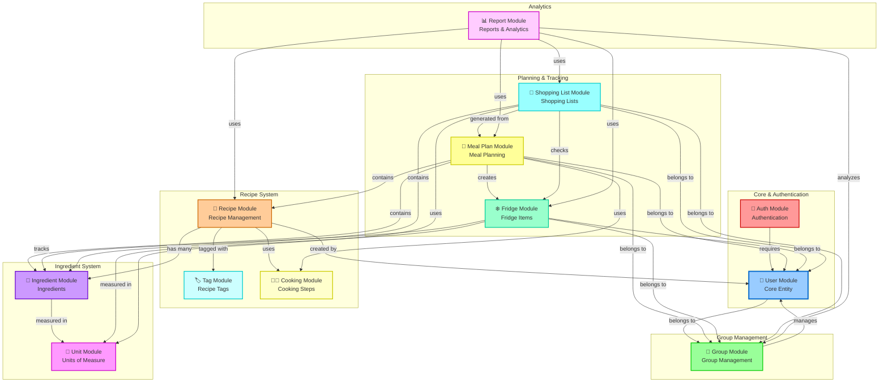

## 12. Module Dependencies - Sơ Đồ Phụ Thuộc Module (Dạng Flowchart)

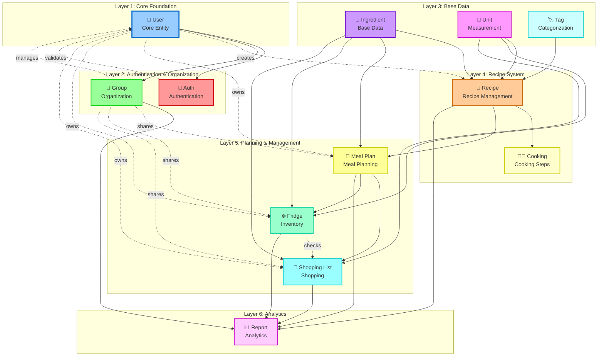

