# EzyMarket System Architecture - Mermaid Diagrams

Tài liệu này cung cấp mã Mermaid để vẽ các biểu đồ kiến trúc toàn hệ thống. Sao chép mã Mermaid vào [Mermaid Live Editor](https://mermaid.live) hoặc các công cụ hỗ trợ Mermaid khác.

---

## 1. Kiến Trúc Tổng Quan (System Overview)

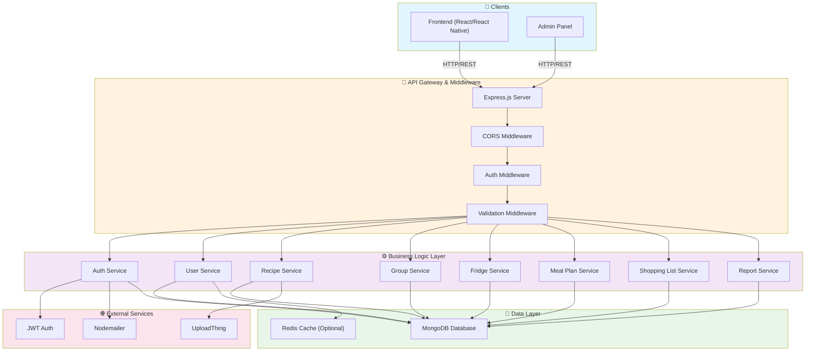

---

## 2. 3-Layer Architecture (Kiến Trúc 3 Tầng)

```mermaid
graph LR
    subgraph Client["Client Layer"]
        REQ["HTTP Requests"]
    end

    subgraph Presentation["📤 Presentation Layer"]
        subgraph Routes["Routes"]
            AuthRoute["authRoute.js"]
            GroupRoute["groupRoute.js"]
            RecipeRoute["recipeRoute.js"]
            IngredientRoute["ingredientRoute.js"]
            UnitRoute["unitRoute.js"]
            FridgeRoute["fridgeItemRoute.js"]
            MealRoute["mealPlanRoute.js"]
            ShoppingRoute["shoppingRoute.js"]
            ReportRoute["reportRoute.js"]
            TagRoute["tagRoute.js"]
        end

        subgraph Controllers["Controllers"]
            AuthCtrl["authController.js"]
            GroupCtrl["groupController.js"]
            RecipeCtrl["recipeController.js"]
            IngredientCtrl["ingredientController.js"]
            UnitCtrl["unitController.js"]
            FridgeCtrl["fridgeItemController.js"]
            MealCtrl["mealPlanController.js"]
            ShoppingCtrl["shoppingController.js"]
            ReportCtrl["reportController.js"]
            TagCtrl["tagController.js"]
        end
    end

    subgraph Business["💼 Business Logic Layer"]
        subgraph BusinessServices["Services"]
            AuthSvc["authService.js"]
            GroupSvc["groupService.js"]
            RecipeSvc["recipeService.js"]
            IngredientSvc["ingredientService.js"]
            UnitSvc["unitService.js"]
            FridgeSvc["fridgeItemService.js"]
            MealSvc["mealPlanService.js"]
            ShoppingListSvc["shoppingListService.js"]
            ReportSvc["reportService.js"]
            TagSvc["tagService.js"]
        end

        subgraph Utilities["Utilities"]
            Helper["Helper Functions"]
            Validation["Validation Rules"]
            Constants["Constants"]
        end
    end

    subgraph Data["💾 Data Access Layer"]
        subgraph Repositories["Repositories/Models"]
            UserRepo["userRepository.js"]
            GroupRepo["groupRepository.js"]
            RecipeRepo["recipeRepository.js"]
            IngredientRepo["ingredientRepository.js"]
            UnitRepo["unitRepository.js"]
            FridgeRepo["fridgeItemRepository.js"]
            MealRepo["mealPlanRepository.js"]
            ShoppingRepo["shoppingListRepository.js"]
            TagRepo["tagRepository.js"]
        end

        subgraph Database["Database"]
            MongoDB["🍃 MongoDB"]
        end
    end

    Client --> REQ
    REQ --> Routes
    Routes --> Controllers
    Controllers --> BusinessServices
    BusinessServices --> Repositories
    Repositories --> Database

    Controllers --> Utilities
    BusinessServices --> Utilities

    style Client fill:#e1f5ff
    style Presentation fill:#fff3e0
    style Business fill:#f3e5f5
    style Data fill:#e8f5e9
```

---

## 3. Module Dependencies (Các Module Phụ Thuộc)

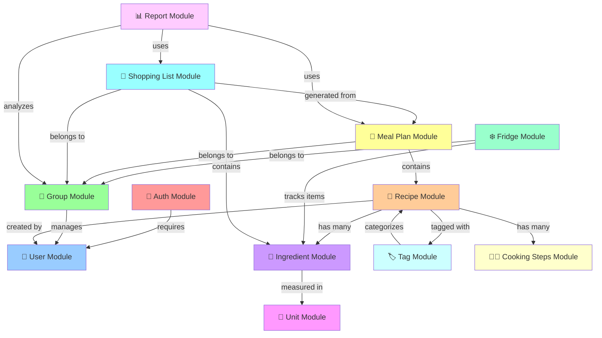

---

## 4. Request/Response Flow (Luồng Yêu Cầu & Phản Hồi)

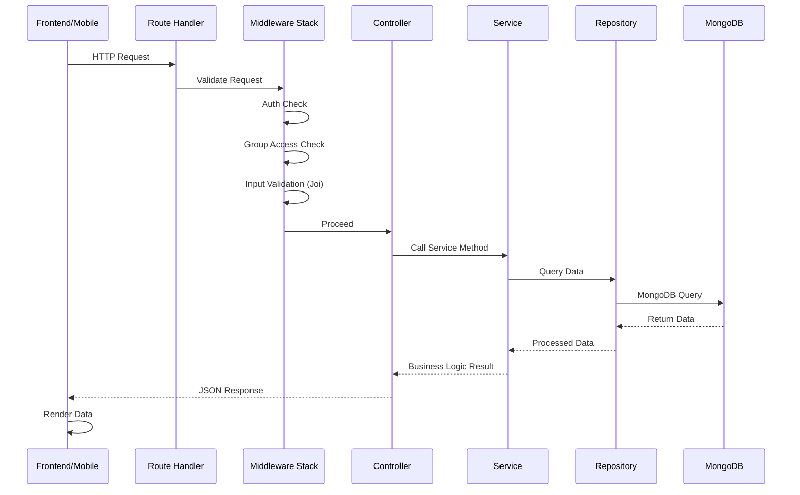

---

## 5. Authentication & Security Flow (Luồng Xác Thực & Bảo Mật)

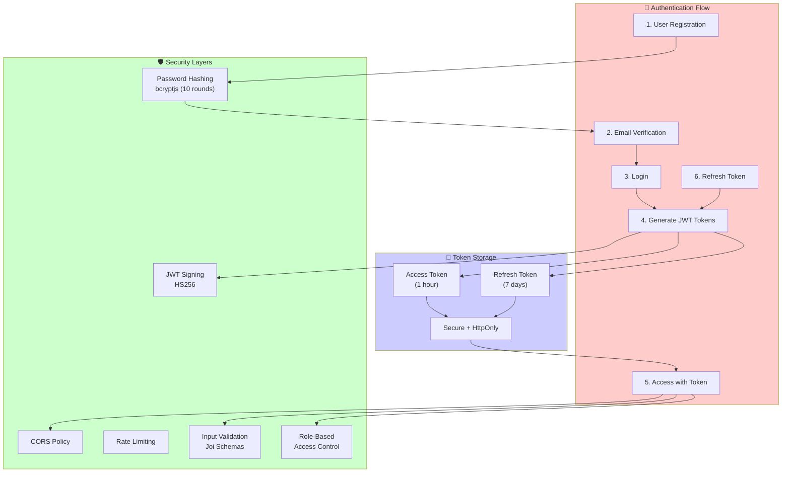

---

## 6. Database Schema & Relationships (Sơ Đồ Cơ Sở Dữ Liệu)

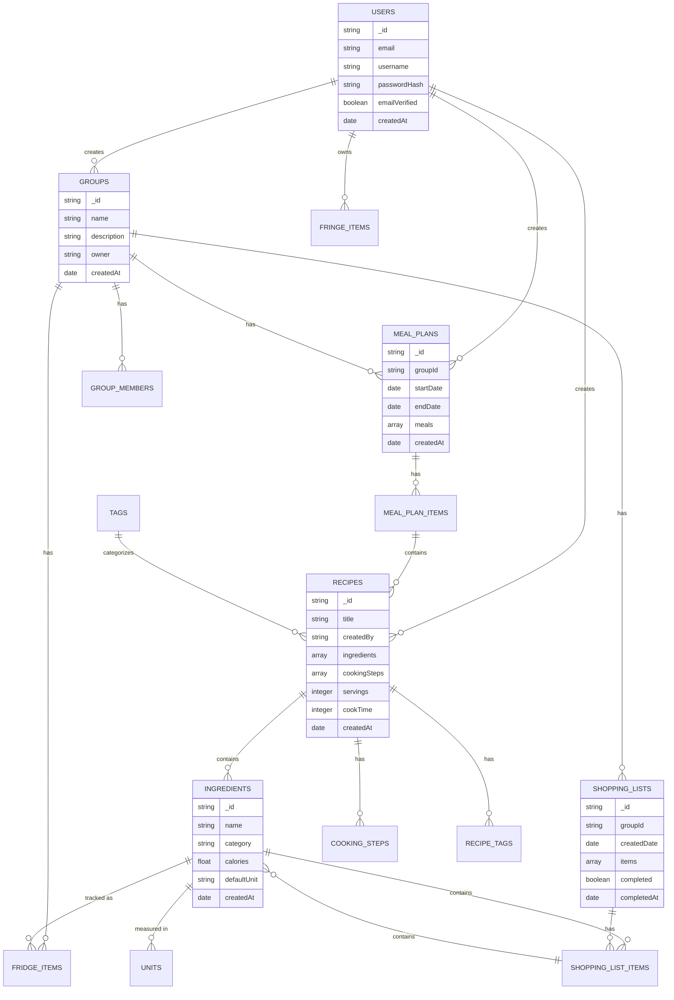

---

## 7. File Structure & Module Organization

```mermaid
graph TB
    Root["ezymarket-be"]

    Config["config/"]
    Controllers["controllers/"]
    Middlewares["middlewares/"]
    Models["model/"]
    Routes["routes/"]
    Services["services/"]
    Utils["utils/"]

    Root --> Config
    Root --> Controllers
    Root --> Middlewares
    Root --> Models
    Root --> Routes
    Root --> Services
    Root --> Utils
    Root --> index.js

    Config --> DB["db.js"]
    Config --> Auth["authConst.js"]
    Config --> Swagger["swagger.js"]
    Config --> Upload["uploadthing.js"]

    Controllers --> AuthCtrl["authController.js"]
    Controllers --> GroupCtrl["groupController.js"]
    Controllers --> RecipeCtrl["recipeController.js"]
    Controllers --> IngredientCtrl["ingredientController.js"]
    Controllers --> UnitCtrl["unitController.js"]
    Controllers --> FridgeCtrl["fridgeItemController.js"]
    Controllers --> MealCtrl["mealPlanController.js"]
    Controllers --> ShoppingCtrl["shoppingController.js"]
    Controllers --> ReportCtrl["reportController.js"]
    Controllers --> TagCtrl["tagController.js"]
    Controllers --> CookCtrl["cookingController.js"]

    Middlewares --> AuthMw["authMiddleware.js"]
    Middlewares --> GroupMw["groupMiddleware.js"]
    Middlewares --> OwnerMw["ownershipMiddleware.js"]
    Middlewares --> ValidMw["validationMiddleware.js"]
    Middlewares --> ShoppingMw["shoppingListMiddleware.js"]
    Middlewares --> UnitMw["unitMiddleware.js"]

    Models --> UserModel["userRepository.js"]
    Models --> GroupModel["groupRepository.js"]
    Models --> RecipeModel["recipeRepository.js"]
    Models --> IngredientModel["ingredientRepository.js"]
    Models --> UnitModel["unitRepository.js"]
    Models --> FridgeModel["fridgeItemRepository.js"]
    Models --> MealModel["mealPlanRepository.js"]
    Models --> ShoppingModel["shoppingListRepository.js"]
    Models --> TagModel["tagRepository.js"]

    Routes --> AuthRoute["authRoute.js"]
    Routes --> GroupRoute["groupRoute.js"]
    Routes --> RecipeRoute["recipeRoute.js"]
    Routes --> IngredientRoute["ingredientRoute.js"]
    Routes --> UnitRoute["unitRoute.js"]
    Routes --> FridgeRoute["fridgeItemRoute.js"]
    Routes --> MealRoute["mealPlanRoute.js"]
    Routes --> ShoppingRoute["shoppingRoute.js"]
    Routes --> ReportRoute["reportRoute.js"]
    Routes --> TagRoute["tagRoute.js"]
    Routes --> UploadRoute["upload.routes.js"]

    Services --> AuthSvc["authService.js"]
    Services --> GroupSvc["groupService.js"]
    Services --> RecipeSvc["recipeService.js"]
    Services --> IngredientSvc["ingredientService.js"]
    Services --> UnitSvc["unitService.js"]
    Services --> FridgeSvc["fridgeItemService.js"]
    Services --> MealSvc["mealPlanService.js"]
    Services --> ShoppingListSvc["shoppingListService.js"]
    Services --> ReportSvc["reportService.js"]
    Services --> TagSvc["tagService.js"]
    Services --> EmailService["verifyEmail.js"]

    Utils --> Helper["helperFunctions.js"]
    Utils --> Constant["constants.js"]
    Utils --> Error["errorHandler.js"]

    style Root fill:#e3f2fd
    style Config fill:#fff3e0
    style Controllers fill:#f3e5f5
    style Middlewares fill:#fce4ec
    style Models fill:#e8f5e9
    style Routes fill:#f1f8e9
    style Services fill:#ede7f6
    style Utils fill:#e0f2f1
```

---

## 8. API Endpoint Hierarchy (Cấu Trúc API)

```mermaid
graph TB
    API["/ - API Root"]

    Auth["/api/auth"]
    AuthLogin["/api/auth/login"]
    AuthRegister["/api/auth/register"]
    AuthVerify["/api/auth/verify"]
    AuthRefresh["/api/auth/refresh"]
    AuthLogout["/api/auth/logout"]
    AuthPasswordReset["/api/auth/password-reset"]

    Users["/api/users"]
    UserProfile["/api/users/profile"]
    UserUpdate["/api/users/:id"]

    Groups["/api/groups"]
    GroupList["/api/groups"]
    GroupCreate["/api/groups"]
    GroupDetail["/api/groups/:id"]
    GroupUpdate["/api/groups/:id"]
    GroupDelete["/api/groups/:id"]
    GroupMembers["/api/groups/:id/members"]

    Recipes["/api/recipes"]
    RecipeList["/api/recipes"]
    RecipeCreate["/api/recipes"]
    RecipeDetail["/api/recipes/:id"]
    RecipeSearch["/api/recipes/search"]

    Ingredients["/api/ingredients"]
    IngredientList["/api/ingredients"]
    IngredientCreate["/api/ingredients"]

    Units["/api/units"]
    UnitList["/api/units"]

    Fridge["/api/fridge"]
    FridgeList["/api/fridge"]
    FridgeAdd["/api/fridge/add"]
    FridgeUpdate["/api/fridge/:id"]

    Meals["/api/meals"]
    MealList["/api/meals"]
    MealCreate["/api/meals"]

    Shopping["/api/shopping"]
    ShoppingList["/api/shopping"]
    ShoppingCreate["/api/shopping"]
    ShoppingItem["/api/shopping/:id/items"]

    Reports["/api/reports"]
    ReportStats["/api/reports/stats"]

    API --> Auth
    Auth --> AuthLogin
    Auth --> AuthRegister
    Auth --> AuthVerify
    Auth --> AuthRefresh
    Auth --> AuthLogout
    Auth --> AuthPasswordReset

    API --> Users
    Users --> UserProfile
    Users --> UserUpdate

    API --> Groups
    Groups --> GroupList
    Groups --> GroupCreate
    Groups --> GroupDetail
    Groups --> GroupUpdate
    Groups --> GroupDelete
    Groups --> GroupMembers

    API --> Recipes
    Recipes --> RecipeList
    Recipes --> RecipeCreate
    Recipes --> RecipeDetail
    Recipes --> RecipeSearch

    API --> Ingredients
    Ingredients --> IngredientList
    Ingredients --> IngredientCreate

    API --> Units
    Units --> UnitList

    API --> Fridge
    Fridge --> FridgeList
    Fridge --> FridgeAdd
    Fridge --> FridgeUpdate

    API --> Meals
    Meals --> MealList
    Meals --> MealCreate

    API --> Shopping
    Shopping --> ShoppingList
    Shopping --> ShoppingCreate
    Shopping --> ShoppingItem

    API --> Reports
    Reports --> ReportStats

    style API fill:#bbdefb
    style Auth fill:#ffccbc
    style Users fill:#c8e6c9
    style Groups fill:#f8bbd0
    style Recipes fill:#ffe0b2
    style Ingredients fill:#dcedc8
    style Units fill:#b2dfdb
    style Fridge fill:#e1bee7
    style Meals fill:#f0f4c3
    style Shopping fill:#d1c4e9
    style Reports fill:#ffcccc
```

---

## 9. Data Processing Pipeline (Quy Trình Xử Lý Dữ Liệu)

```mermaid
graph LR
    Request["📥 HTTP Request"]
    Parse["Parse Body"]
    ValidInput["Validate Input"]
    AuthUser["Authenticate User"]
    CheckGroup["Check Group Access"]
    CheckOwner["Check Ownership"]
    Process["Business Logic"]
    QueryDB["Query Database"]
    Transform["Transform Data"]
    Response["Format Response"]
    Send["📤 Send Response"]

    Error["❌ Error Handler"]

    Request --> Parse
    Parse --> ValidInput
    ValidInput -->|Invalid| Error
    ValidInput -->|Valid| AuthUser
    AuthUser -->|Invalid| Error
    AuthUser -->|Valid| CheckGroup
    CheckGroup -->|No Access| Error
    CheckGroup -->|Has Access| CheckOwner
    CheckOwner -->|No Ownership| Error
    CheckOwner -->|Owner| Process

    Process --> QueryDB
    QueryDB --> Transform
    Transform --> Response
    Response --> Send

    Error --> Send

    style Request fill:#c3e9ff
    style Parse fill:#bbdefb
    style ValidInput fill:#90caf9
    style AuthUser fill:#64b5f6
    style CheckGroup fill:#42a5f5
    style CheckOwner fill:#2196f3
    style Process fill:#1e88e5
    style QueryDB fill:#1976d2
    style Transform fill:#1565c0
    style Response fill:#0d47a1
    style Send fill:#c3e9ff
    style Error fill:#ffcccc
```

---

## 10. Deployment Architecture (Kiến Trúc Triển Khai)

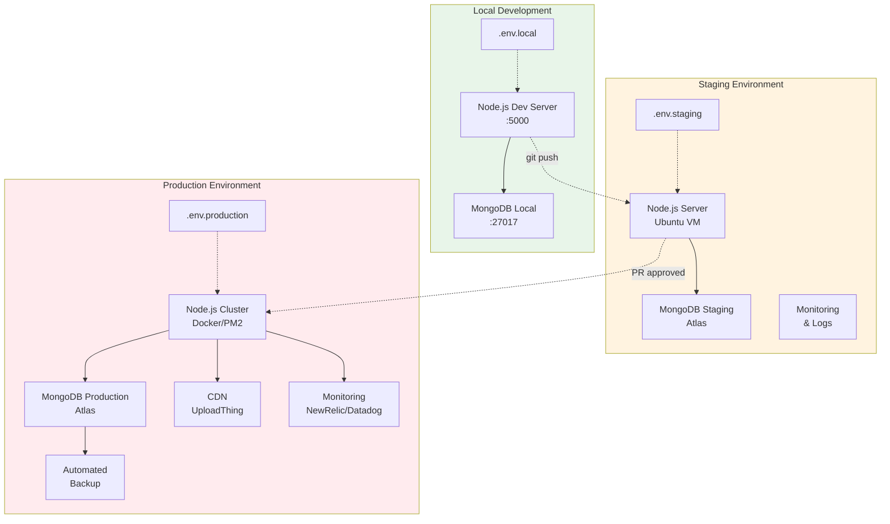

---

## Hướng Dẫn Sử Dụng Mermaid

### Option 1: Mermaid Live Editor

1. Truy cập [https://mermaid.live](https://mermaid.live)
2. Sao chép mã Mermaid từ bên dưới
3. Dán vào editor
4. Chỉnh sửa và xuất hình ảnh

### Option 2: VS Code Extension

```bash
# Cài đặt Markdown Preview Mermaid Support
# Extension ID: bierner.markdown-mermaid
```

### Option 3: GitHub/GitLab Markdown

Sao chép code block vào markdown file - tự động render!

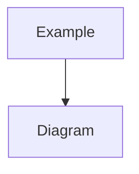

### Option 4: Notion Integration

- Notion hỗ trợ mermaid trực tiếp
- Sao chép code vào code block

---

## Tài Liệu Tham Khảo

- [Mermaid Documentation](https://mermaid.js.org/)
- [EzyMarket Backend Architecture](./BACKEND_ARCHITECTURE.md)
- [API Endpoints](./API_ENDPOINTS_DOCUMENTATION.md)
- [Data Flow Diagrams](./DATA_FLOW_DIAGRAMS.md)

---

**Cập nhật lần cuối**: Tháng 1 năm 2026
