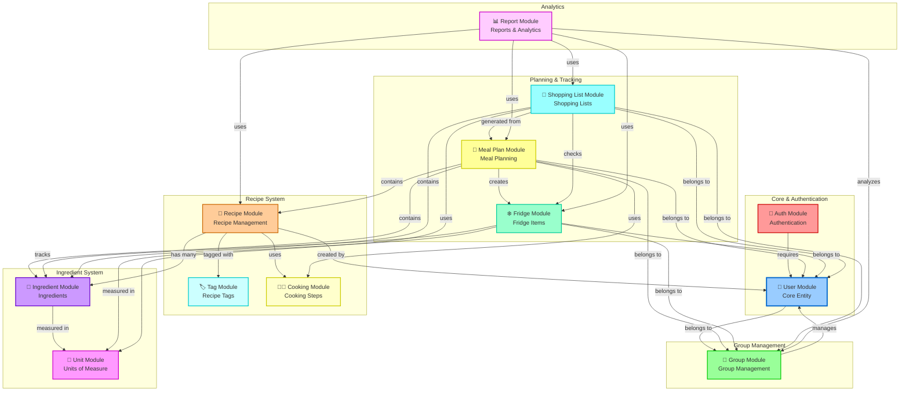
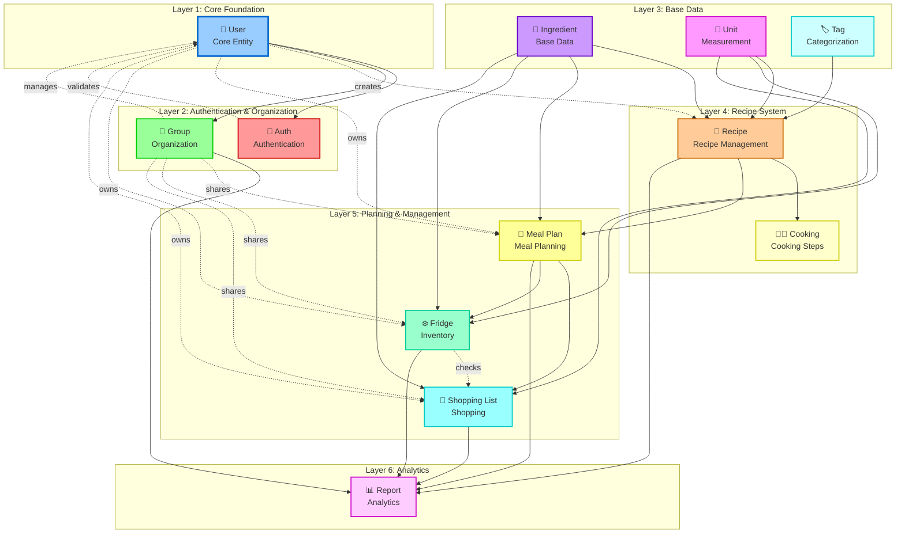
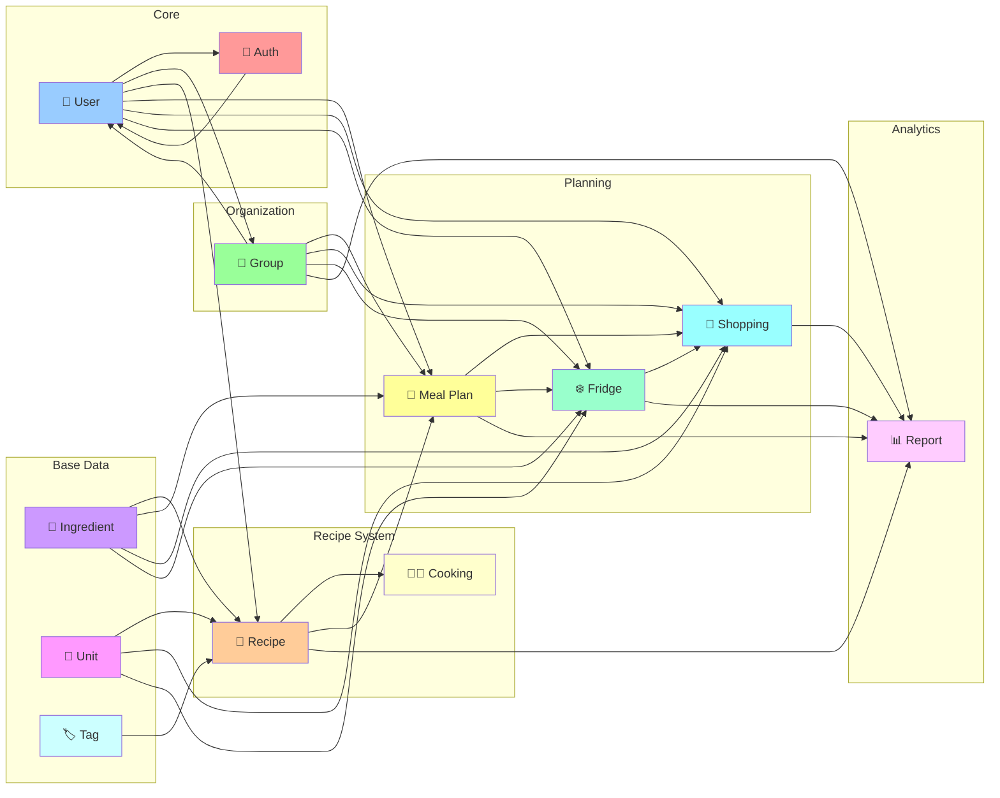

# EzyMarket - Module Dependencies Diagram

## Sơ Đồ Phụ Thuộc Module (Layout Tối Ưu - Không Rối Đường)

Sơ đồ này mô tả mối quan hệ và phụ thuộc giữa các module trong hệ thống EzyMarket với layout được tối ưu để tránh đường nối chéo nhau.

### Phiên Bản 1: Layout Nhóm Module (Recommended)

### Phiên Bản 2: Layout Phân Lớp (Layered Architecture)

### Phiên Bản 3: Layout Đơn Giản (Compact)

## Mô Tả Các Phụ Thuộc

### Core Dependencies
- **Auth → User**: Module xác thực yêu cầu User module
- **Group → User**: Module nhóm quản lý người dùng
- **User → Group**: Người dùng thuộc về nhóm

### Recipe System Dependencies
- **Recipe → User**: Công thức được tạo bởi người dùng
- **Recipe → Ingredient**: Công thức chứa nhiều nguyên liệu
- **Recipe → Cook**: Công thức sử dụng các bước nấu
- **Recipe → Tag**: Công thức được gắn thẻ
- **Ingredient → Unit**: Nguyên liệu được đo bằng đơn vị

### Planning Dependencies
- **MealPlan → User/Group**: Kế hoạch bữa ăn thuộc về người dùng/nhóm
- **MealPlan → Recipe**: Kế hoạch chứa công thức
- **MealPlan → Ingredient**: Kế hoạch chứa nguyên liệu
- **MealPlan → Cook**: Kế hoạch sử dụng các bước nấu
- **MealPlan → Fridge**: Kế hoạch tạo ra các món đã nấu trong tủ lạnh

### Fridge Dependencies
- **Fridge → User/Group**: Tủ lạnh thuộc về người dùng/nhóm
- **Fridge → Ingredient**: Tủ lạnh theo dõi nguyên liệu
- **Fridge → Unit**: Tủ lạnh sử dụng đơn vị đo

### Shopping List Dependencies
- **ShoppingList → User/Group**: Danh sách mua sắm thuộc về người dùng/nhóm
- **ShoppingList → MealPlan**: Danh sách được tạo từ kế hoạch bữa ăn
- **ShoppingList → Ingredient**: Danh sách chứa nguyên liệu
- **ShoppingList → Unit**: Danh sách sử dụng đơn vị đo
- **ShoppingList → Fridge**: Danh sách kiểm tra tủ lạnh để tránh mua trùng

### Report Dependencies
- **Report → Group**: Báo cáo phân tích nhóm
- **Report → ShoppingList**: Báo cáo sử dụng danh sách mua sắm
- **Report → MealPlan**: Báo cáo sử dụng kế hoạch bữa ăn
- **Report → Fridge**: Báo cáo sử dụng dữ liệu tủ lạnh
- **Report → Recipe**: Báo cáo sử dụng dữ liệu công thức

## Hướng Dẫn Sử Dụng

1. **Copy mã Mermaid** từ bất kỳ phiên bản nào phù hợp với nhu cầu
2. **Paste vào**:
   - File Markdown (README.md, documentation)
   - GitHub/GitLab (tự động render)
   - Mermaid Live Editor: https://mermaid.live
   - Notion, Confluence (hỗ trợ Mermaid)
3. **Export** sang PNG/SVG từ Mermaid Live Editor nếu cần

## Khuyến Nghị

- **Phiên bản 1** (Layout Nhóm Module): Tốt nhất cho tài liệu báo cáo, dễ đọc và hiểu
- **Phiên bản 2** (Layout Phân Lớp): Tốt cho giải thích kiến trúc phân lớp
- **Phiên bản 3** (Layout Đơn Giản): Tốt cho slide presentation, compact và gọn

